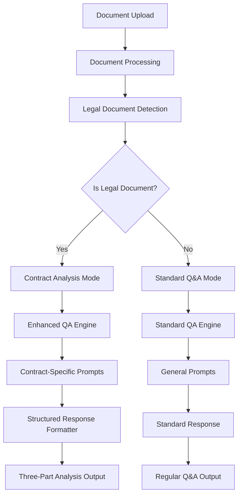

# Contract Analyst Chatbot Design Document

## Overview

This design document outlines the enhancement of the existing Document Q&A System to become a specialized Contract Analyst Chatbot. The enhancement focuses on transforming the current general-purpose document Q&A capabilities into a sophisticated legal document analyzer that provides structured, evidence-based analysis with specific formatting for legal documents, particularly Material Transfer Agreements (MTAs).

The design leverages the existing QA engine architecture while introducing specialized prompt engineering, response formatting, and legal document detection capabilities.

## Architecture

The contract analyst enhancement will be implemented through:

1. **Enhanced QA Engine**: Extend the existing `QAEngine` class with contract analysis capabilities
2. **Legal Document Detection**: Implement document type classification to identify legal documents
3. **Specialized Prompt System**: Create contract-specific prompts that enforce the structured response format
4. **Response Formatter**: Implement structured response parsing and formatting
5. **Legal Terminology Handler**: Add legal-specific term extraction and context matching

### System Components Integration



## Components and Interfaces

### Enhanced QA Engine

**New Class: `ContractAnalystEngine`**
- Extends existing `QAEngine` functionality
- Implements contract-specific analysis methods
- Manages legal document detection and routing

**Key Methods:**
```python
class ContractAnalystEngine(QAEngine):
    def detect_legal_document(self, document: Document) -> bool
    def generate_contract_analysis(self, question: str, context_sections: List[Dict], document: Document) -> Dict[str, str]
    def format_structured_response(self, analysis_parts: Dict[str, str]) -> str
    def extract_legal_terms(self, question: str) -> List[str]
    def find_legal_context(self, question: str, document: Document) -> List[Dict[str, Any]]
```

### Legal Document Detection

**Document Classification System:**
- Keyword-based detection for legal documents
- Pattern matching for contract structures
- MTA-specific identification
- Confidence scoring for document type classification

**Detection Criteria:**
- Legal keywords: "agreement", "contract", "terms", "conditions", "liability", "intellectual property"
- MTA-specific terms: "material transfer", "research use", "derivatives", "publication"
- Document structure patterns: numbered sections, exhibits, signature blocks

### Specialized Prompt System

**Contract Analysis Prompts:**
- Three-part response structure enforcement
- Legal document context awareness
- Evidence-based reasoning requirements
- Balanced analysis for subjective questions

**Prompt Templates:**
```python
CONTRACT_ANALYSIS_PROMPT = """
You are a contract analyst chatbot that helps users understand legal and research agreements. 
Your primary reference is the provided document. 

### Guidelines:
- Always ground answers in the text of the document. Quote specific clauses or exhibits when possible.
- If a question is subjective (e.g., "who benefits more?"), provide balanced reasoning using evidence from the agreement. 
- Do NOT say "the document doesn't say"; instead, infer from ownership, IP, liability, or restrictions.
- Structure answers in this format:

1. **Direct Evidence**: Cite or paraphrase relevant parts of the agreement.
2. **Plain-English Explanation**: Explain what it means in simple language.
3. **Implication / Analysis** (if applicable): Who it benefits, what risk it creates, what actions are required.

### Style:
- Be clear, conversational, and professional.
- Avoid legalese unless quoting directly.
- If multiple sections are relevant, summarize across them instead of giving a single-clause answer.

Document: {document_title}
Context: {context_text}
Question: {question}

Provide your analysis:
"""
```

### Response Formatter

**Structured Response Parser:**
- Extracts three-part analysis from AI response
- Validates response structure
- Formats output with proper headers and styling
- Handles edge cases where structure is incomplete

**Response Structure:**
```python
@dataclass
class ContractAnalysisResponse:
    direct_evidence: str
    plain_explanation: str
    implication_analysis: Optional[str]
    sources: List[str]
    confidence: float
    document_type: str
```

## Data Models

### Enhanced Document Model

**New Fields for Legal Documents:**
```python
@dataclass
class Document:
    # Existing fields...
    is_legal_document: bool = False
    legal_document_type: Optional[str] = None  # "MTA", "NDA", "Service Agreement", etc.
    contract_parties: Optional[List[str]] = None
    key_legal_terms: Optional[List[str]] = None
    legal_analysis_confidence: float = 0.0
```

### Contract Analysis Session

**Enhanced QA Session for Legal Documents:**
```python
@dataclass
class ContractAnalysisSession(QASession):
    analysis_mode: str = "contract"  # "contract" or "standard"
    legal_document_type: Optional[str] = None
    structured_responses: List[ContractAnalysisResponse] = field(default_factory=list)
```

## Error Handling

### Legal Document Processing Errors
- **Document Classification Failures**: Fallback to standard Q&A mode with notification
- **Structured Response Parsing Errors**: Attempt to reformat or provide standard response
- **Legal Context Extraction Failures**: Use general context matching with legal term weighting

### Response Quality Assurance
- **Incomplete Structure Detection**: Prompt for missing sections or provide partial analysis
- **Low Confidence Analysis**: Display confidence warnings and suggest document review
- **Contradictory Evidence**: Highlight conflicting sections and provide balanced interpretation

## Testing Strategy

### Legal Document Detection Testing
1. **Document Type Classification**: Test with various legal document types (MTAs, NDAs, service agreements)
2. **False Positive Prevention**: Ensure non-legal documents aren't misclassified
3. **Confidence Scoring**: Validate classification confidence thresholds

### Contract Analysis Quality Testing
1. **Response Structure Validation**: Ensure all responses follow three-part format
2. **Evidence Grounding**: Verify all claims are supported by document text
3. **Legal Accuracy**: Test with known legal documents and validate interpretations
4. **Subjective Question Handling**: Test balanced reasoning for opinion-based questions

### Integration Testing
1. **Mode Switching**: Test seamless transition between contract and standard analysis
2. **Session Continuity**: Ensure legal analysis sessions maintain context
3. **UI Integration**: Verify enhanced responses display correctly in interface
4. **Performance Impact**: Ensure legal analysis doesn't significantly impact response times

## Implementation Approach

### Phase 1: Core Contract Analysis Engine
- Extend QAEngine with ContractAnalystEngine class
- Implement legal document detection system
- Create contract-specific prompt templates
- Build structured response formatter

### Phase 2: Enhanced Legal Context Processing
- Implement legal term extraction and weighting
- Add contract-specific context matching
- Enhance evidence citation and source tracking
- Integrate MTA-specific analysis patterns

### Phase 3: UI Integration and User Experience
- Add contract analysis mode indicators in UI
- Implement structured response display formatting
- Add legal document type badges and indicators
- Create contract analysis help and examples

### Phase 4: Advanced Features and Optimization
- Add confidence scoring for legal interpretations
- Implement contract comparison capabilities
- Add legal document templates and examples
- Optimize performance for large legal documents

## Technical Considerations

### Prompt Engineering
- Balance between structure enforcement and natural language generation
- Handle edge cases where documents don't fit standard legal patterns
- Maintain consistency across different legal document types

### Performance Optimization
- Cache legal document classifications to avoid re-processing
- Optimize legal term extraction for large documents
- Implement efficient context matching for legal concepts

### Scalability
- Design system to handle multiple legal document types beyond MTAs
- Create extensible framework for adding new contract analysis patterns
- Ensure system can scale to handle enterprise-level legal document volumes

The implementation will maintain backward compatibility with existing functionality while providing enhanced capabilities for legal document analysis.