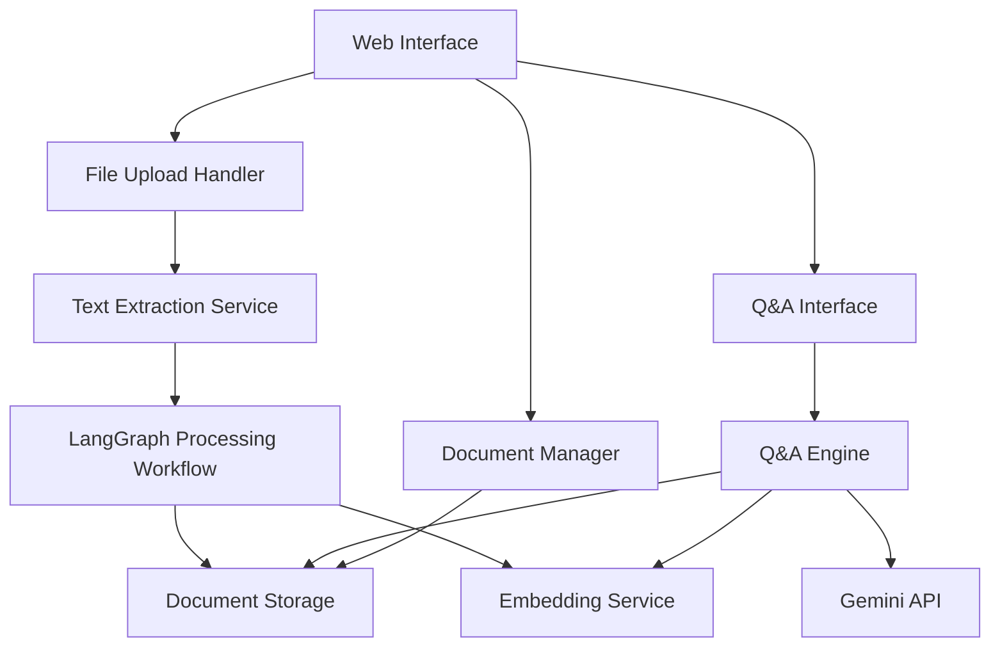

# Design Document

## Overview

The enhanced document Q&A system builds upon the existing workflow-based document processing architecture in `a.py` to create a comprehensive solution with file upload capabilities, proper LangGraph integration, document storage, and intelligent Q&A functionality. The system maintains the current modular approach while adding new components for file handling, persistent storage, and interactive querying.

## Architecture

### High-Level Architecture



### Component Architecture

The system follows a layered architecture with clear separation of concerns:

1. **Presentation Layer**: Web-based UI using Streamlit for simplicity and rapid development
2. **Service Layer**: Business logic including file processing, Q&A engine, and document management
3. **Workflow Layer**: LangGraph-based processing pipeline
4. **Data Layer**: Document storage and embedding management
5. **Integration Layer**: Gemini API integration and external services

## Components and Interfaces

### 1. Web Interface (Streamlit-based)

**Purpose**: Provides user-friendly interface for document upload, processing monitoring, and Q&A interaction.

**Key Features**:
- File upload component supporting PDF, TXT, DOCX formats
- Real-time processing progress display
- Document list management
- Q&A chat interface
- Processing results visualization

**Interface**:
```python
class WebInterface:
    def render_upload_section() -> None
    def render_document_list() -> None
    def render_qa_interface(document_id: str) -> None
    def render_processing_status(job_id: str) -> None
```

### 2. File Upload Handler

**Purpose**: Manages file uploads, validation, and text extraction from various document formats.

**Key Features**:
- File format validation (PDF, TXT, DOCX, max 10MB)
- Text extraction using appropriate libraries
- File metadata extraction
- Error handling for corrupted files

**Interface**:
```python
class FileUploadHandler:
    def validate_file(file: UploadedFile) -> bool
    def extract_text(file: UploadedFile) -> str
    def get_file_metadata(file: UploadedFile) -> Dict[str, Any]
```

### 3. Enhanced LangGraph Workflow

**Purpose**: Extends the existing workflow with additional nodes for embedding generation and Q&A preparation.

**Enhanced Workflow Nodes**:
- `document_intake_node` (existing, enhanced)
- `classification_node` (existing)
- `extraction_node` (existing)
- `analysis_node` (existing)
- `embedding_generation_node` (new)
- `qa_preparation_node` (new)
- `storage_node` (new)
- `summary_generation_node` (existing)

**Interface**:
```python
class EnhancedDocumentWorkflow:
    def create_workflow() -> StateGraph
    def process_document(document_data: Dict[str, Any]) -> Dict[str, Any]
    def get_processing_status(job_id: str) -> str
```

### 4. Document Storage Service

**Purpose**: Manages persistent storage of processed documents, metadata, and embeddings.

**Key Features**:
- SQLite database for document metadata and processing results
- File system storage for original documents
- Vector storage for document embeddings
- CRUD operations for document management

**Interface**:
```python
class DocumentStorage:
    def store_document(doc_data: Dict[str, Any]) -> str
    def get_document(doc_id: str) -> Dict[str, Any]
    def list_documents() -> List[Dict[str, Any]]
    def delete_document(doc_id: str) -> bool
    def store_embeddings(doc_id: str, embeddings: List[float]) -> None
```

### 5. Q&A Engine

**Purpose**: Handles question answering using processed document context and Gemini API.

**Key Features**:
- Context-aware question processing
- Relevant document section retrieval
- Answer generation with source attribution
- Conversation history management

**Interface**:
```python
class QAEngine:
    def answer_question(question: str, doc_id: str) -> Dict[str, Any]
    def get_relevant_context(question: str, doc_id: str) -> List[str]
    def generate_answer(question: str, context: List[str]) -> str
```

## Data Models

### Document Model
```python
@dataclass
class Document:
    id: str
    title: str
    file_type: str
    file_size: int
    upload_timestamp: datetime
    processing_status: str
    original_text: str
    document_type: str
    extracted_info: Dict[str, Any]
    analysis: str
    summary: str
    embeddings: Optional[List[float]]
```

### Processing Job Model
```python
@dataclass
class ProcessingJob:
    job_id: str
    document_id: str
    status: str  # pending, processing, completed, failed
    current_step: str
    progress_percentage: int
    error_message: Optional[str]
    created_at: datetime
    completed_at: Optional[datetime]
```

### Q&A Session Model
```python
@dataclass
class QASession:
    session_id: str
    document_id: str
    questions: List[Dict[str, Any]]  # question, answer, timestamp, sources
    created_at: datetime
```

## Error Handling

### File Upload Errors
- **Invalid file format**: Clear error message with supported formats
- **File too large**: Size limit notification with current file size
- **Corrupted file**: Text extraction failure handling
- **Network errors**: Upload retry mechanism

### Processing Errors
- **API failures**: Retry logic with exponential backoff
- **Workflow errors**: Graceful degradation and error reporting
- **Storage errors**: Transaction rollback and cleanup
- **Timeout handling**: Long-running process management

### Q&A Errors
- **No relevant context**: Inform user that answer cannot be found
- **API rate limits**: Queue management and user notification
- **Invalid questions**: Input validation and suggestions

## Testing Strategy

### Unit Testing
- **File handlers**: Test various file formats and edge cases
- **Workflow nodes**: Mock API calls and test processing logic
- **Storage operations**: Test CRUD operations and data integrity
- **Q&A engine**: Test context retrieval and answer generation

### Integration Testing
- **End-to-end workflow**: Test complete document processing pipeline
- **API integration**: Test Gemini API integration with various inputs
- **Storage integration**: Test database and file system operations
- **UI integration**: Test user interactions and data flow

### Performance Testing
- **File upload**: Test with various file sizes and formats
- **Concurrent processing**: Test multiple document processing
- **Q&A response time**: Test query performance with large documents
- **Storage scalability**: Test with increasing number of documents

### User Acceptance Testing
- **Upload workflow**: Test user experience for document upload
- **Processing feedback**: Test real-time progress updates
- **Q&A interaction**: Test question-answer flow and accuracy
- **Document management**: Test document list and deletion features

## Security Considerations

### API Key Management
- Environment variable storage for API keys
- No hardcoded credentials in source code
- Secure key rotation capabilities

### File Upload Security
- File type validation and sanitization
- Size limits to prevent DoS attacks
- Virus scanning for uploaded files
- Secure temporary file handling

### Data Privacy
- Local storage of processed documents
- No data transmission to unauthorized services
- User consent for data processing
- Data retention policies

## Performance Optimization

### Caching Strategy
- Cache processed document results
- Cache embeddings for faster Q&A
- Cache API responses where appropriate

### Async Processing
- Background document processing
- Non-blocking UI updates
- Queue management for multiple uploads

### Resource Management
- Memory-efficient text processing
- Cleanup of temporary files
- Database connection pooling

## Deployment Considerations

### Environment Setup
- Python 3.8+ requirement
- Required dependencies installation
- Environment variable configuration
- Database initialization scripts

### Scalability
- Modular architecture for easy extension
- Configurable processing limits
- Horizontal scaling capabilities for future growth

### Monitoring
- Processing job status tracking
- Error logging and alerting
- Performance metrics collection
- User activity monitoring