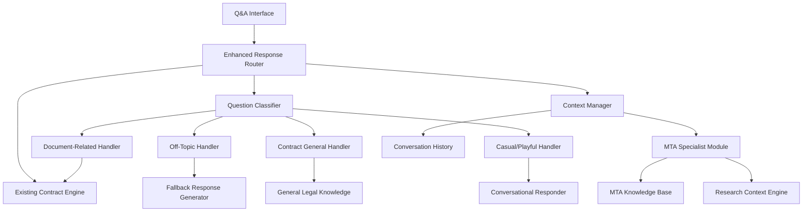
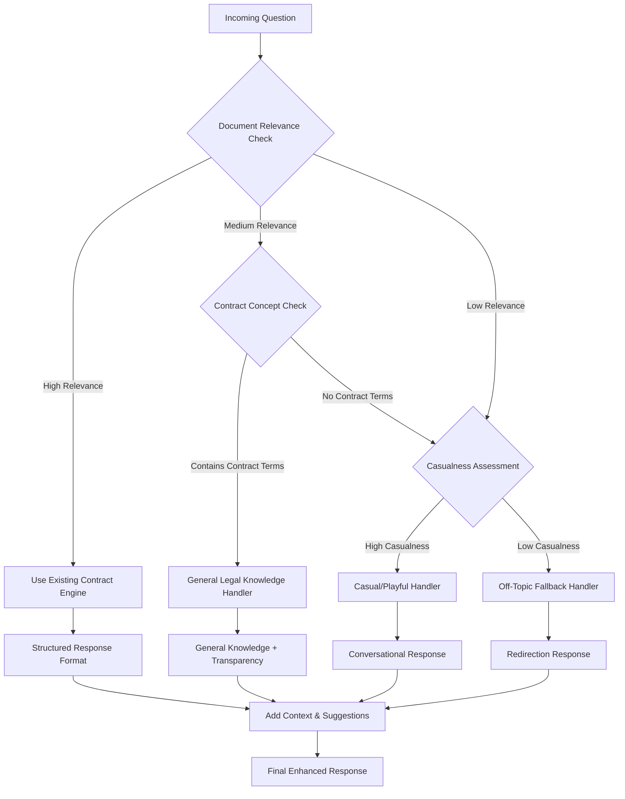

# Design Document

## Overview

The Enhanced Contract Assistant builds upon the existing ContractAnalystEngine to provide improved conversational behavior, graceful handling of off-topic questions, and specialized Material Transfer Agreement (MTA) expertise. The design maintains backward compatibility while adding intelligent response routing, enhanced fallback mechanisms, and contextual awareness for better user experience.

## Architecture

### High-Level Architecture



### Integration with Existing System

The enhanced contract assistant integrates with the current system by:

- **Wrapping the existing ContractAnalystEngine**: Preserving all current functionality
- **Adding a routing layer**: Intelligently directing questions to appropriate handlers
- **Extending response formatting**: Maintaining existing structure while adding fallback capabilities
- **Enhancing context management**: Building on existing conversation tracking

## Components and Interfaces

### 1. Enhanced Response Router

**Purpose**: Routes questions to appropriate handlers based on question type and context, ensuring every question receives a helpful response.

**Key Features**:
- Question classification and routing
- Fallback response coordination
- Response format standardization
- Context-aware routing decisions

**Interface**:
```python
class EnhancedResponseRouter:
    def route_question(self, question: str, document_id: str, session_id: str) -> EnhancedResponse
    def classify_question_intent(self, question: str, document_context: str) -> QuestionIntent
    def determine_response_strategy(self, intent: QuestionIntent, document: Document) -> ResponseStrategy
    def coordinate_fallback_response(self, question: str, intent: QuestionIntent) -> FallbackResponse
```

### 2. Question Classifier

**Purpose**: Analyzes questions to determine the most appropriate response strategy and handler.

**Key Features**:
- Intent classification (document-related, off-topic, contract-general, casual)
- Confidence scoring for classification decisions
- Multi-intent detection for compound questions
- Context-aware classification using conversation history

**Interface**:
```python
class QuestionClassifier:
    def classify_intent(self, question: str, context: ConversationContext) -> QuestionIntent
    def detect_document_relevance(self, question: str, document: Document) -> float
    def identify_contract_concepts(self, question: str) -> List[str]
    def assess_casualness_level(self, question: str) -> float
    def detect_mta_specificity(self, question: str, document: Document) -> bool
```

### 3. Fallback Response Generator

**Purpose**: Generates helpful responses for off-topic, irrelevant, or playful questions while maintaining professional tone.

**Key Features**:
- Graceful acknowledgment of off-topic questions
- Redirection to relevant document topics
- Conversational and humorous responses when appropriate
- Suggestion generation for better questions

**Interface**:
```python
class FallbackResponseGenerator:
    def generate_off_topic_response(self, question: str, document: Document) -> str
    def create_playful_response(self, question: str) -> str
    def suggest_relevant_questions(self, document: Document) -> List[str]
    def generate_redirection_response(self, question: str, suggestions: List[str]) -> str
    def create_general_knowledge_response(self, question: str, topic: str) -> str
```

### 4. MTA Specialist Module

**Purpose**: Provides specialized knowledge and context for Material Transfer Agreement analysis and questions.

**Key Features**:
- MTA-specific terminology and concept recognition
- Research collaboration context understanding
- IP rights and material transfer protocol knowledge
- Academic and research industry best practices

**Interface**:
```python
class MTASpecialistModule:
    def analyze_mta_context(self, document: Document) -> MTAContext
    def provide_mta_expertise(self, question: str, context: MTAContext) -> MTAInsight
    def explain_mta_concepts(self, concepts: List[str]) -> Dict[str, str]
    def suggest_mta_considerations(self, analysis: ContractAnalysisResponse) -> List[str]
    def generate_research_context(self, clause: str) -> str
```

### 5. Enhanced Context Manager

**Purpose**: Manages conversation context and history to provide contextually aware responses and maintain conversation flow.

**Key Features**:
- Conversation history tracking with intent classification
- Context-aware response generation
- Tone and style consistency management
- Follow-up question context retention

**Interface**:
```python
class EnhancedContextManager:
    def update_conversation_context(self, session_id: str, question: str, response: EnhancedResponse) -> None
    def get_conversation_context(self, session_id: str) -> ConversationContext
    def analyze_conversation_flow(self, session_id: str) -> ConversationFlow
    def suggest_context_aware_responses(self, question: str, context: ConversationContext) -> List[str]
    def detect_conversation_patterns(self, session_id: str) -> List[ConversationPattern]
```

## Data Models

### Enhanced Response Models

```python
@dataclass
class EnhancedResponse:
    content: str
    response_type: str  # document_analysis, fallback, general_knowledge, casual
    confidence: float
    sources: List[str]
    suggestions: List[str]
    tone: str  # professional, conversational, playful
    structured_format: Optional[ContractAnalysisResponse]
    context_used: List[str]
    timestamp: datetime

@dataclass
class QuestionIntent:
    primary_intent: str  # document_related, off_topic, contract_general, casual
    confidence: float
    secondary_intents: List[str]
    document_relevance_score: float
    casualness_level: float
    requires_mta_expertise: bool
    requires_fallback: bool

@dataclass
class ResponseStrategy:
    handler_type: str  # existing_contract, fallback, general_knowledge, casual
    use_structured_format: bool
    include_suggestions: bool
    tone_preference: str
    fallback_options: List[str]
    context_requirements: List[str]
```

### MTA-Specific Models

```python
@dataclass
class MTAContext:
    document_id: str
    provider_entity: Optional[str]
    recipient_entity: Optional[str]
    material_types: List[str]
    research_purposes: List[str]
    ip_considerations: List[str]
    key_restrictions: List[str]
    collaboration_type: str  # academic, commercial, hybrid

@dataclass
class MTAInsight:
    concept_explanations: Dict[str, str]
    research_implications: List[str]
    common_practices: List[str]
    risk_considerations: List[str]
    suggested_questions: List[str]
```

### Conversation Management Models

```python
@dataclass
class ConversationContext:
    session_id: str
    document_id: str
    conversation_history: List[ConversationTurn]
    current_tone: str
    topic_progression: List[str]
    user_expertise_level: str  # beginner, intermediate, expert
    preferred_response_style: str

@dataclass
class ConversationTurn:
    question: str
    response: EnhancedResponse
    intent: QuestionIntent
    strategy_used: ResponseStrategy
    user_satisfaction: Optional[int]
    timestamp: datetime

@dataclass
class ConversationFlow:
    session_id: str
    flow_type: str  # linear, exploratory, focused, casual
    topic_coherence: float
    engagement_level: float
    complexity_progression: str  # increasing, decreasing, stable
    suggested_directions: List[str]
```

## Response Generation Logic

### Question Routing Decision Tree



### Response Format Strategy

1. **Document-Related Questions**: Use existing structured format (Direct Evidence, Plain-English Explanation, Implication/Analysis)
2. **Contract-General Questions**: Provide general knowledge with transparency prefix + structured format when applicable
3. **Off-Topic Questions**: Acknowledge + redirect with suggestions
4. **Casual/Playful Questions**: Conversational response + gentle redirect to document topics

## Error Handling

### Classification Errors
- **Ambiguous Intent**: Default to document analysis with fallback note
- **Multiple Intents**: Address primary intent, acknowledge others
- **Classification Failure**: Use existing contract engine as safe fallback

### Response Generation Errors
- **Fallback Generator Failure**: Use simple acknowledgment + basic redirection
- **MTA Specialist Failure**: Fall back to general contract analysis
- **Context Manager Failure**: Continue without context, log for improvement

### Integration Errors
- **Existing Engine Failure**: Provide apologetic fallback with suggestions
- **Routing Failure**: Default to existing contract engine behavior
- **Format Conversion Errors**: Return raw response with error note

## Testing Strategy

### Unit Testing
- **Question Classification**: Test intent detection accuracy across question types
- **Fallback Generation**: Test response quality for various off-topic scenarios
- **MTA Expertise**: Test MTA-specific knowledge and context generation
- **Context Management**: Test conversation flow and context retention

### Integration Testing
- **End-to-End Routing**: Test complete question-to-response flow
- **Backward Compatibility**: Ensure existing functionality remains intact
- **Response Quality**: Test response appropriateness across scenarios
- **Performance Impact**: Measure latency introduced by routing layer

### User Experience Testing
- **Conversation Flow**: Test natural conversation progression
- **Fallback Effectiveness**: Test user satisfaction with off-topic responses
- **MTA Expertise**: Test accuracy and helpfulness of MTA-specific responses
- **Tone Consistency**: Test professional yet approachable tone maintenance

## Performance Considerations

### Response Time Optimization
- **Quick Classification**: Efficient intent detection algorithms
- **Cached Responses**: Cache common fallback responses and MTA insights
- **Parallel Processing**: Route to existing engine while preparing fallbacks
- **Context Optimization**: Efficient conversation history management

### Memory Management
- **Context Storage**: Limit conversation history size with intelligent pruning
- **MTA Knowledge**: Lazy loading of specialized knowledge bases
- **Response Caching**: Time-based cache expiration for dynamic content
- **Fallback Templates**: Pre-generated response templates for common scenarios

## Security and Privacy

### Data Handling
- **Conversation Privacy**: Secure storage of conversation context
- **Response Logging**: Anonymized logging for improvement without PII
- **Fallback Responses**: Ensure no sensitive information in general responses
- **Context Isolation**: Prevent cross-session context leakage

### Input Validation
- **Question Sanitization**: Validate and sanitize user inputs
- **Intent Classification**: Prevent manipulation of classification logic
- **Response Generation**: Validate generated responses for appropriateness
- **Context Updates**: Secure conversation context modifications

## Deployment Strategy

### Gradual Rollout
1. **Phase 1**: Deploy with existing engine as primary, enhanced as secondary
2. **Phase 2**: Enable enhanced routing for new sessions
3. **Phase 3**: Migrate existing sessions to enhanced behavior
4. **Phase 4**: Full deployment with monitoring and feedback collection

### Configuration Management
- **Feature Flags**: Toggle enhanced behavior components
- **Response Thresholds**: Configurable confidence thresholds for routing
- **Fallback Options**: Configurable fallback response strategies
- **MTA Expertise**: Toggle MTA-specific enhancements

### Monitoring and Analytics
- **Response Quality Metrics**: Track user satisfaction and response appropriateness
- **Classification Accuracy**: Monitor intent detection performance
- **Fallback Usage**: Track frequency and effectiveness of fallback responses
- **Performance Metrics**: Monitor response time and system resource usage