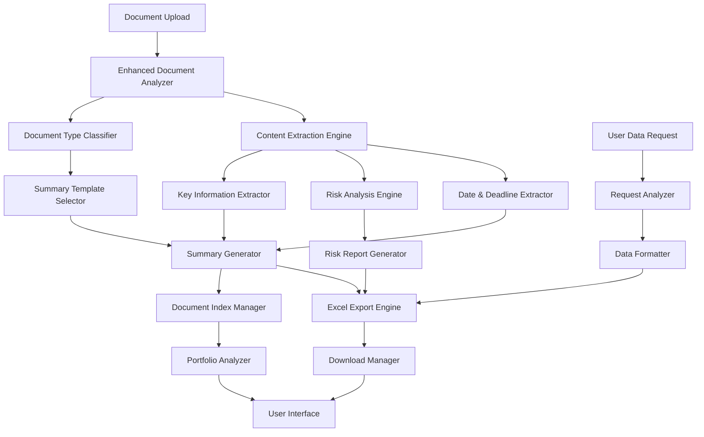

# Design Document

## Overview

The Enhanced Document Summaries and Exports system transforms the document analysis capabilities by providing comprehensive, structured summaries and robust Excel export functionality. The design focuses on intelligent document parsing, template-based summary generation, comprehensive risk analysis, and guaranteed export capabilities that never refuse user requests for tabular data.

## Architecture

### High-Level Architecture



### Integration Strategy

The system integrates with existing components by:
- **Extending existing document analysis**: Building on current contract analysis capabilities
- **Enhancing storage layer**: Adding structured metadata and indexing capabilities
- **Wrapping export functionality**: Ensuring all data requests result in downloadable files
- **Maintaining API compatibility**: Preserving existing interfaces while adding new capabilities

## Components and Interfaces

### 1. Enhanced Document Analyzer

**Purpose**: Comprehensive analysis of uploaded documents to extract all relevant information for summaries and risk analysis.

**Key Features**:
- Multi-format document parsing (PDF, Word, text)
- Intelligent content extraction using NLP and pattern recognition
- Legal term identification and definition extraction
- Cross-reference detection between document sections
- Metadata extraction and classification

**Interface**:
```python
class EnhancedDocumentAnalyzer:
    def analyze_document_comprehensive(self, document: Document) -> DocumentAnalysis
    def extract_document_metadata(self, document: Document) -> DocumentMetadata
    def identify_document_structure(self, content: str) -> DocumentStructure
    def extract_legal_entities(self, content: str) -> List[LegalEntity]
    def detect_cross_references(self, content: str) -> List[CrossReference]
```

### 2. Document Type Classifier

**Purpose**: Automatically identifies document types to select appropriate summary templates and analysis approaches.

**Key Features**:
- Machine learning-based document classification
- Support for contracts, MTAs, purchase agreements, disclosure schedules
- Confidence scoring for classification decisions
- Fallback to general templates when type is unclear
- Custom type definition support

**Interface**:
```python
class DocumentTypeClassifier:
    def classify_document_type(self, document: Document) -> DocumentTypeResult
    def get_confidence_score(self, classification: str, content: str) -> float
    def identify_document_subtypes(self, doc_type: str, content: str) -> List[str]
    def suggest_template_customizations(self, doc_type: str) -> List[TemplateCustomization]
    def register_custom_document_type(self, type_definition: CustomDocumentType) -> bool
```

### 3. Summary Template Selector

**Purpose**: Selects and customizes summary templates based on document type and content characteristics.

**Key Features**:
- Template library for different document types
- Dynamic template customization based on content
- Section prioritization based on document importance
- Template inheritance and composition
- User-defined template support

**Interface**:
```python
class SummaryTemplateSelector:
    def select_template(self, doc_type: str, content_analysis: ContentAnalysis) -> SummaryTemplate
    def customize_template_sections(self, template: SummaryTemplate, document: Document) -> SummaryTemplate
    def prioritize_sections(self, sections: List[str], importance_scores: Dict[str, float]) -> List[str]
    def merge_template_components(self, base_template: SummaryTemplate, additions: List[TemplateComponent]) -> SummaryTemplate
    def validate_template_completeness(self, template: SummaryTemplate) -> ValidationResult
```

### 4. Key Information Extractor

**Purpose**: Extracts critical information elements from documents including terms, dates, parties, and obligations.

**Key Features**:
- Named entity recognition for parties and organizations
- Financial term extraction (amounts, payment schedules, pricing)
- Legal obligation identification and categorization
- Deadline and milestone extraction
- Relationship mapping between extracted entities

**Interface**:
```python
class KeyInformationExtractor:
    def extract_parties_and_entities(self, content: str) -> List[Party]
    def identify_key_terms_and_definitions(self, content: str) -> Dict[str, str]
    def extract_financial_information(self, content: str) -> FinancialSummary
    def identify_obligations_and_commitments(self, content: str) -> List[Obligation]
    def extract_governing_clauses(self, content: str) -> List[GoverningClause]
```

### 5. Risk Analysis Engine

**Purpose**: Comprehensive risk assessment with categorization, severity scoring, and mitigation recommendations.

**Key Features**:
- Multi-dimensional risk categorization (financial, legal, operational, reputational)
- Severity scoring with consistent criteria
- Risk interconnection analysis
- Mitigation strategy generation
- Timeline-based risk materialization analysis

**Interface**:
```python
class RiskAnalysisEngine:
    def analyze_document_risks(self, document: Document, content_analysis: ContentAnalysis) -> RiskAnalysis
    def categorize_risks(self, identified_risks: List[Risk]) -> Dict[str, List[Risk]]
    def score_risk_severity(self, risk: Risk, context: DocumentContext) -> RiskScore
    def generate_mitigation_strategies(self, risk: Risk) -> List[MitigationStrategy]
    def analyze_risk_interconnections(self, risks: List[Risk]) -> RiskRelationshipMap
    def create_risk_timeline(self, risks: List[Risk]) -> RiskTimeline
```

### 6. Excel Export Engine

**Purpose**: Guaranteed Excel export generation that never refuses user requests for tabular data.

**Key Features**:
- Multi-sheet Excel workbook generation
- Dynamic data formatting and validation
- Template-based report generation
- Fallback mechanisms for complex data
- Download link management with expiration

**Interface**:
```python
class ExcelExportEngine:
    def generate_risk_analysis_report(self, risk_analysis: RiskAnalysis) -> ExcelReport
    def create_document_summary_export(self, summary: DocumentSummary) -> ExcelReport
    def generate_portfolio_analysis_report(self, documents: List[Document]) -> ExcelReport
    def export_tabular_data(self, data: TableData, format_preferences: ExportPreferences) -> ExcelReport
    def create_custom_report(self, data_sources: List[DataSource], template: ReportTemplate) -> ExcelReport
    def ensure_export_never_fails(self, data: Any, fallback_format: str) -> ExportResult
```

### 7. Document Index Manager

**Purpose**: Maintains organized index of all documents with searchable metadata and relationship tracking.

**Key Features**:
- Searchable document metadata storage
- Relationship mapping between documents
- Deadline and milestone tracking
- Portfolio-level analytics
- Automated index updates

**Interface**:
```python
class DocumentIndexManager:
    def add_document_to_index(self, document: Document, analysis: DocumentAnalysis) -> IndexEntry
    def update_document_relationships(self, document_id: str, related_docs: List[str]) -> bool
    def search_documents(self, query: SearchQuery) -> List[IndexEntry]
    def get_upcoming_deadlines(self, timeframe: timedelta) -> List[Deadline]
    def generate_portfolio_summary(self, filter_criteria: FilterCriteria) -> PortfolioSummary
    def track_document_changes(self, document_id: str, changes: List[Change]) -> ChangeLog
```

## Data Models

### Core Document Models

```python
@dataclass
class DocumentAnalysis:
    document_id: str
    document_type: str
    classification_confidence: float
    key_information: KeyInformation
    risk_analysis: RiskAnalysis
    summary_sections: Dict[str, str]
    metadata: DocumentMetadata
    relationships: List[DocumentRelationship]
    analysis_timestamp: datetime

@dataclass
class DocumentSummary:
    overview: str
    key_terms: Dict[str, str]
    important_dates: List[ImportantDate]
    parties_involved: List[Party]
    liabilities_and_risks: List[Risk]
    recommended_actions: List[Action]
    document_type_specific_info: Dict[str, Any]
    confidence_indicators: Dict[str, float]

@dataclass
class KeyInformation:
    parties: List[Party]
    financial_terms: FinancialSummary
    key_dates: List[ImportantDate]
    obligations: List[Obligation]
    governing_clauses: List[GoverningClause]
    definitions: Dict[str, str]
    cross_references: List[CrossReference]
```

### Risk Analysis Models

```python
@dataclass
class RiskAnalysis:
    overall_risk_score: float
    risk_categories: Dict[str, List[Risk]]
    risk_matrix: RiskMatrix
    mitigation_strategies: List[MitigationStrategy]
    risk_timeline: RiskTimeline
    interconnected_risks: List[RiskRelationship]
    confidence_level: float

@dataclass
class Risk:
    risk_id: str
    description: str
    category: str  # financial, legal, operational, reputational
    severity: str  # High, Medium, Low
    probability: float
    impact_description: str
    affected_parties: List[str]
    materialization_timeframe: Optional[str]
    source_sections: List[str]
    mitigation_strategies: List[str]

@dataclass
class RiskMatrix:
    high_probability_high_impact: List[Risk]
    high_probability_low_impact: List[Risk]
    low_probability_high_impact: List[Risk]
    low_probability_low_impact: List[Risk]
    risk_distribution_summary: Dict[str, int]
```

### Export and Template Models

```python
@dataclass
class ExcelReport:
    file_path: str
    filename: str
    sheets: List[ExcelSheet]
    download_url: str
    expiration_time: datetime
    metadata: ReportMetadata
    generation_timestamp: datetime

@dataclass
class ExcelSheet:
    name: str
    data: List[Dict[str, Any]]
    formatting: SheetFormatting
    charts: List[ChartDefinition]
    pivot_tables: List[PivotTableDefinition]
    conditional_formatting: List[ConditionalFormat]

@dataclass
class SummaryTemplate:
    template_id: str
    document_type: str
    sections: List[TemplateSection]
    required_fields: List[str]
    optional_fields: List[str]
    formatting_rules: Dict[str, str]
    customization_options: List[CustomizationOption]
```

### Index and Portfolio Models

```python
@dataclass
class IndexEntry:
    document_id: str
    title: str
    document_type: str
    upload_date: datetime
    parties: List[str]
    key_dates: List[ImportantDate]
    risk_summary: RiskSummary
    status: str
    tags: List[str]
    relationships: List[str]

@dataclass
class PortfolioSummary:
    total_documents: int
    document_type_breakdown: Dict[str, int]
    upcoming_deadlines: List[Deadline]
    high_risk_documents: List[str]
    portfolio_risk_score: float
    key_metrics: Dict[str, float]
    recommendations: List[str]
```

## Summary Generation Strategy

### 1. Contract Summary Template

**Sections**:
- **Overview**: Document type, parties, effective dates, purpose
- **Key Terms**: Payment terms, deliverables, performance obligations
- **Important Dates**: Effective date, expiration, renewal options, key milestones
- **Liabilities & Risks**: Indemnification, limitation of liability, termination risks
- **Recommended Actions**: Review requirements, compliance steps, renewal decisions

**Implementation**:
```python
def generate_contract_summary(self, document: Document, analysis: DocumentAnalysis) -> DocumentSummary:
    return DocumentSummary(
        overview=self._extract_contract_overview(analysis),
        key_terms=self._extract_contract_terms(analysis),
        important_dates=self._extract_contract_dates(analysis),
        parties_involved=analysis.key_information.parties,
        liabilities_and_risks=analysis.risk_analysis.risk_categories.get('legal', []),
        recommended_actions=self._generate_contract_actions(analysis)
    )
```

### 2. MTA Summary Template

**Sections**:
- **Overview**: Research purpose, material description, institutions involved
- **Research Restrictions**: Use limitations, publication requirements, collaboration rules
- **Material Handling**: Storage requirements, safety protocols, disposal procedures
- **IP and Publication**: Ownership rights, publication review, derivative works
- **Compliance Requirements**: Regulatory obligations, reporting requirements

### 3. Purchase Agreement Summary Template

**Sections**:
- **Overview**: Vendor information, purchase scope, contract value
- **Purchase Schedule**: Delivery dates, quantities, pricing structure
- **Payment Terms**: Payment schedule, invoicing requirements, penalties
- **Quality and Compliance**: Specifications, acceptance criteria, warranties
- **Risk Factors**: Delivery risks, quality risks, financial exposure

## Risk Analysis Implementation

### Risk Categorization Framework

**Financial Risks**:
- Payment default risk
- Cost overrun exposure
- Currency/pricing fluctuation
- Budget impact assessment

**Legal Risks**:
- Compliance violations
- Indemnification exposure
- Intellectual property disputes
- Regulatory non-compliance

**Operational Risks**:
- Delivery delays
- Performance failures
- Resource availability
- Process disruptions

**Reputational Risks**:
- Public relations impact
- Stakeholder confidence
- Brand damage potential
- Regulatory scrutiny

### Risk Scoring Methodology

```python
def calculate_risk_score(self, risk: Risk, context: DocumentContext) -> RiskScore:
    # Base scoring factors
    probability_weight = 0.4
    impact_weight = 0.4
    mitigation_difficulty_weight = 0.2
    
    # Calculate component scores
    probability_score = self._assess_probability(risk, context)
    impact_score = self._assess_impact(risk, context)
    mitigation_score = self._assess_mitigation_difficulty(risk, context)
    
    # Weighted final score
    final_score = (
        probability_score * probability_weight +
        impact_score * impact_weight +
        mitigation_score * mitigation_difficulty_weight
    )
    
    return RiskScore(
        overall_score=final_score,
        severity=self._map_score_to_severity(final_score),
        components={
            'probability': probability_score,
            'impact': impact_score,
            'mitigation_difficulty': mitigation_score
        }
    )
```

## Excel Export Implementation

### Never-Fail Export Strategy

**Primary Export Path**:
1. Detect data structure and format requirements
2. Generate appropriate Excel template
3. Populate data with proper formatting
4. Create download link with expiration

**Fallback Mechanisms**:
1. **Complex Data Fallback**: Break into multiple simpler sheets
2. **Formatting Fallback**: Use basic formatting if advanced fails
3. **Excel Fallback**: Generate CSV if Excel creation fails
4. **Data Fallback**: Provide structured text if all exports fail

**Implementation**:
```python
def ensure_export_never_fails(self, data: Any, user_request: str) -> ExportResult:
    try:
        # Primary: Full Excel with formatting
        return self._generate_full_excel_export(data, user_request)
    except Exception as e1:
        try:
            # Fallback 1: Basic Excel without advanced formatting
            return self._generate_basic_excel_export(data, user_request)
        except Exception as e2:
            try:
                # Fallback 2: CSV export
                return self._generate_csv_export(data, user_request)
            except Exception as e3:
                # Fallback 3: Structured text with download
                return self._generate_text_export(data, user_request)
```

### Multi-Sheet Report Structure

**Risk Analysis Report Sheets**:
1. **Executive Summary**: High-level risk overview and recommendations
2. **Risk Matrix**: Visual risk categorization and prioritization
3. **Detailed Risks**: Complete risk descriptions with mitigation strategies
4. **Action Plan**: Prioritized actions with timelines and responsibilities
5. **Supporting Data**: Raw data and calculations for transparency

**Document Summary Report Sheets**:
1. **Document Overview**: Key information and metadata
2. **Parties & Terms**: Detailed party information and key terms
3. **Important Dates**: Timeline view of all critical dates
4. **Financial Summary**: All financial terms and obligations
5. **Compliance Checklist**: Required actions and deadlines

## Error Handling and Fallbacks

### Document Analysis Errors
- **Parsing Failures**: Use OCR fallback for image-based PDFs
- **Classification Uncertainty**: Use general template with confidence indicators
- **Content Extraction Issues**: Provide partial analysis with clear limitations
- **Template Selection Errors**: Default to comprehensive general template

### Export Generation Errors
- **Data Formatting Issues**: Simplify format and retry
- **File Size Limitations**: Split into multiple files
- **Template Loading Failures**: Use basic formatting templates
- **Download Link Creation**: Provide alternative access methods

### Risk Analysis Errors
- **Incomplete Risk Detection**: Provide analysis with confidence qualifiers
- **Scoring Calculation Errors**: Use simplified scoring with manual review flags
- **Mitigation Strategy Failures**: Provide general best practices
- **Timeline Analysis Issues**: Focus on immediate risks with clear limitations

## Testing Strategy

### Document Summary Testing
- **Template Accuracy**: Test summary generation across different document types
- **Information Extraction**: Validate key information extraction accuracy
- **Template Customization**: Test dynamic template selection and customization
- **Portfolio Integration**: Test multi-document indexing and relationship mapping

### Risk Analysis Testing
- **Risk Detection**: Test identification of various risk types across document types
- **Scoring Consistency**: Validate risk scoring methodology across similar risks
- **Mitigation Quality**: Test relevance and practicality of mitigation strategies
- **Timeline Accuracy**: Validate risk materialization timeline predictions

### Export Functionality Testing
- **Never-Fail Guarantee**: Test export generation with various data types and edge cases
- **Format Quality**: Validate Excel formatting, charts, and data integrity
- **Download Reliability**: Test download link generation and expiration handling
- **Fallback Mechanisms**: Test all fallback paths for export generation

### Integration Testing
- **UI Integration**: Test seamless integration with existing interface
- **Performance Impact**: Measure analysis and export generation times
- **Concurrent Usage**: Test system behavior with multiple simultaneous requests
- **Data Consistency**: Validate consistency between summaries and exports

## Performance Considerations

### Analysis Optimization
- **Parallel Processing**: Process different analysis components simultaneously
- **Caching Strategy**: Cache document analysis results and template selections
- **Incremental Updates**: Update only changed sections when documents are modified
- **Resource Management**: Optimize memory usage for large document processing

### Export Generation Optimization
- **Template Caching**: Pre-load and cache frequently used Excel templates
- **Asynchronous Generation**: Generate exports in background for large reports
- **File Management**: Implement efficient cleanup of temporary export files
- **Compression**: Use compression for large export files to improve download speed

### Scalability Considerations
- **Concurrent Processing**: Handle multiple document analyses simultaneously
- **Storage Optimization**: Efficient storage of document metadata and analysis results
- **Index Performance**: Optimize document index for fast searching and filtering
- **Export Queue Management**: Queue system for handling multiple export requests

## Security and Privacy

### Document Security
- **Access Control**: Ensure users can only access their own documents and analyses
- **Data Encryption**: Encrypt sensitive document content and analysis results
- **Audit Logging**: Log all document access and analysis activities
- **Retention Policies**: Implement configurable data retention and deletion policies

### Export Security
- **Secure Downloads**: Generate secure, time-limited download links
- **Data Sanitization**: Remove sensitive information from exports when appropriate
- **Access Logging**: Log all export generation and download activities
- **File Cleanup**: Automatic cleanup of temporary export files

### Privacy Protection
- **Data Minimization**: Only extract and store necessary information
- **Anonymization Options**: Provide options to anonymize sensitive data in exports
- **Consent Management**: Clear consent for data processing and analysis
- **Compliance**: Ensure compliance with relevant data protection regulations

## Deployment Strategy

### Phased Implementation
1. **Phase 1**: Enhanced document analysis and summary generation
2. **Phase 2**: Risk analysis engine and categorization
3. **Phase 3**: Excel export engine with never-fail guarantee
4. **Phase 4**: Portfolio management and document indexing
5. **Phase 5**: Advanced features and customization options

### Configuration Management
- **Template Configuration**: Configurable summary templates for different document types
- **Risk Parameters**: Adjustable risk scoring parameters and thresholds
- **Export Settings**: Configurable export formats and retention policies
- **Performance Tuning**: Adjustable caching and processing parameters

### Monitoring and Analytics
- **Usage Analytics**: Track document analysis patterns and user preferences
- **Performance Metrics**: Monitor analysis times and export generation performance
- **Quality Metrics**: Track accuracy of document classification and risk assessment
- **User Satisfaction**: Monitor user engagement with summaries and exports
- **Error Tracking**: Comprehensive logging and analysis of system errors and fallbacks