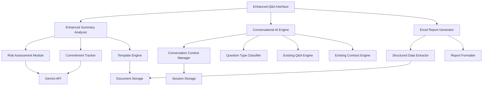

# Design Document

## Overview

The enhanced Q&A capabilities feature extends the existing document Q&A system with advanced analytical features, conversational AI capabilities, and data export functionality. The design builds upon the current architecture while adding new components for risk analysis, conversational context management, and Excel generation. The system maintains backward compatibility with existing Q&A functionality while providing specialized analysis modes for different document types.

## Architecture

### High-Level Architecture



### Integration with Existing System

The enhanced capabilities integrate seamlessly with the current system:

- **Existing Q&A Engine**: Enhanced with new analysis modes
- **Contract Analyst Engine**: Extended with risk assessment and template support
- **Document Storage**: Enhanced to store analysis templates and structured data
- **UI Components**: Extended with new interface elements for enhanced features

## Components and Interfaces

### 1. Enhanced Summary Analyzer

**Purpose**: Provides comprehensive document analysis with risk assessment, commitment tracking, and customizable analysis templates.

**Key Features**:
- Risk identification and categorization (High, Medium, Low)
- Commitment extraction with parties, obligations, and deadlines
- Deliverable date detection and chronological organization
- Custom template support for specialized analysis
- Integration with existing summary generation

**Interface**:
```python
class EnhancedSummaryAnalyzer:
    def analyze_document_comprehensive(self, document: Document, template: Optional[AnalysisTemplate] = None) -> ComprehensiveAnalysis
    def identify_risks(self, document: Document) -> List[RiskAssessment]
    def extract_commitments(self, document: Document) -> List[Commitment]
    def find_deliverable_dates(self, document: Document) -> List[DeliverableDate]
    def apply_custom_template(self, document: Document, template: AnalysisTemplate) -> Dict[str, Any]
    def generate_enhanced_summary(self, document: Document) -> EnhancedSummary
```

**Data Models**:
```python
@dataclass
class RiskAssessment:
    risk_id: str
    description: str
    severity: str  # High, Medium, Low
    category: str  # Legal, Financial, Operational, etc.
    affected_parties: List[str]
    mitigation_suggestions: List[str]
    source_text: str
    confidence: float

@dataclass
class Commitment:
    commitment_id: str
    description: str
    obligated_party: str
    beneficiary_party: str
    deadline: Optional[datetime]
    status: str  # Active, Completed, Overdue
    source_text: str
    commitment_type: str  # Deliverable, Payment, Action, etc.

@dataclass
class DeliverableDate:
    date: datetime
    description: str
    responsible_party: str
    deliverable_type: str
    status: str
    source_text: str
```

### 2. Conversational AI Engine

**Purpose**: Handles natural conversation flow while maintaining specialized analysis capabilities for legal and technical documents.

**Key Features**:
- Question type classification (casual, compound, legal, technical)
- Conversation context management across question types
- Seamless switching between analysis modes
- Follow-up question handling with context retention
- Clarification request generation for ambiguous questions

**Interface**:
```python
class ConversationalAIEngine:
    def classify_question_type(self, question: str, conversation_history: List[Dict]) -> QuestionType
    def handle_compound_question(self, question: str, document_id: str, session_id: str) -> CompoundResponse
    def manage_conversation_context(self, session_id: str, question: str, response: str) -> None
    def generate_clarification_request(self, ambiguous_question: str) -> str
    def switch_analysis_mode(self, current_mode: str, question: str, document: Document) -> str
    def answer_conversational_question(self, question: str, document_id: str, session_id: str) -> ConversationalResponse
```

**Data Models**:
```python
@dataclass
class QuestionType:
    primary_type: str  # casual, legal, technical, compound
    confidence: float
    sub_types: List[str]
    requires_legal_analysis: bool
    requires_context_switching: bool

@dataclass
class CompoundResponse:
    question_parts: List[str]
    individual_responses: List[Dict[str, Any]]
    synthesized_response: str
    sources: List[str]
    analysis_modes_used: List[str]

@dataclass
class ConversationalResponse:
    answer: str
    conversation_tone: str  # professional, casual, technical
    context_used: List[str]
    follow_up_suggestions: List[str]
    analysis_mode: str
    confidence: float
```

### 3. Excel Report Generator

**Purpose**: Generates structured Excel reports from document analysis and chat interactions with customizable formatting and data organization.

**Key Features**:
- Structured data extraction from documents and conversations
- Multiple sheet generation (Summary, Risks, Commitments, Q&A History)
- Custom report templates based on document type
- Comparative analysis across multiple documents
- Download link generation in chat interface

**Interface**:
```python
class ExcelReportGenerator:
    def generate_document_report(self, document_id: str, report_type: str = "comprehensive") -> ExcelReport
    def generate_conversation_report(self, session_id: str) -> ExcelReport
    def generate_comparative_report(self, document_ids: List[str]) -> ExcelReport
    def create_custom_report(self, data_specification: Dict[str, Any]) -> ExcelReport
    def format_report_data(self, raw_data: Dict[str, Any], template: ReportTemplate) -> Dict[str, Any]
```

**Data Models**:
```python
@dataclass
class ExcelReport:
    report_id: str
    filename: str
    file_path: str
    download_url: str
    sheets: List[ExcelSheet]
    created_at: datetime
    expires_at: datetime

@dataclass
class ExcelSheet:
    name: str
    data: List[Dict[str, Any]]
    formatting: Dict[str, Any]
    charts: List[Dict[str, Any]]
```

### 4. Template Engine

**Purpose**: Manages custom analysis templates and prompts for specialized document analysis.

**Key Features**:
- Predefined templates for common document types (contracts, policies, reports)
- Custom template creation and modification
- Template parameter configuration
- Template recommendation based on document content
- Template versioning and management

**Interface**:
```python
class TemplateEngine:
    def get_predefined_templates(self) -> List[AnalysisTemplate]
    def create_custom_template(self, template_spec: Dict[str, Any]) -> AnalysisTemplate
    def recommend_template(self, document: Document) -> Optional[AnalysisTemplate]
    def apply_template(self, document: Document, template: AnalysisTemplate) -> Dict[str, Any]
    def save_template(self, template: AnalysisTemplate) -> str
    def load_template(self, template_id: str) -> AnalysisTemplate
```

## Data Models

### Enhanced Analysis Models

```python
@dataclass
class ComprehensiveAnalysis:
    document_id: str
    analysis_id: str
    document_overview: str
    key_findings: List[str]
    critical_information: List[str]
    recommended_actions: List[str]
    executive_recommendation: str
    key_legal_terms: List[str]
    risks: List[RiskAssessment]
    commitments: List[Commitment]
    deliverable_dates: List[DeliverableDate]
    template_used: Optional[str]
    confidence_score: float
    created_at: datetime

@dataclass
class AnalysisTemplate:
    template_id: str
    name: str
    description: str
    document_types: List[str]
    analysis_sections: List[str]
    custom_prompts: Dict[str, str]
    parameters: Dict[str, Any]
    created_by: str
    version: str
    is_active: bool
```

### Conversation Management Models

```python
@dataclass
class ConversationContext:
    session_id: str
    document_id: str
    conversation_history: List[ConversationTurn]
    current_topic: str
    analysis_mode: str
    user_preferences: Dict[str, Any]
    context_summary: str

@dataclass
class ConversationTurn:
    turn_id: str
    question: str
    response: str
    question_type: QuestionType
    analysis_mode: str
    sources_used: List[str]
    timestamp: datetime
    user_satisfaction: Optional[int]
```

## Error Handling

### Enhanced Analysis Errors
- **Template Application Failures**: Graceful fallback to standard analysis
- **Risk Assessment Errors**: Partial analysis with error reporting
- **Commitment Extraction Failures**: Continue with available data
- **Date Parsing Errors**: Flag unparseable dates for manual review

### Conversational AI Errors
- **Context Management Failures**: Reset context with user notification
- **Question Classification Errors**: Default to standard Q&A mode
- **Compound Question Parsing**: Break down into simpler questions
- **Mode Switching Failures**: Maintain current mode with error log

### Excel Generation Errors
- **Data Extraction Failures**: Generate partial reports with error notes
- **File Generation Errors**: Provide alternative data formats (CSV, JSON)
- **Download Link Failures**: Offer direct file access options
- **Template Formatting Errors**: Use default formatting with warnings

## Testing Strategy

### Unit Testing
- **Enhanced Summary Components**: Test risk identification, commitment extraction, date parsing
- **Conversational Engine**: Test question classification, context management, mode switching
- **Excel Generator**: Test data extraction, formatting, file generation
- **Template Engine**: Test template application, custom template creation

### Integration Testing
- **End-to-End Analysis**: Test complete enhanced analysis workflow
- **Conversation Flow**: Test multi-turn conversations with context retention
- **Report Generation**: Test Excel generation from real document analysis
- **Template Integration**: Test custom templates with various document types

### Performance Testing
- **Large Document Analysis**: Test enhanced analysis with large documents
- **Concurrent Conversations**: Test multiple simultaneous conversational sessions
- **Excel Generation Speed**: Test report generation performance
- **Template Processing**: Test template application performance

### User Acceptance Testing
- **Enhanced Summary Interface**: Test user interaction with new summary features
- **Conversational Experience**: Test natural conversation flow and satisfaction
- **Report Usability**: Test Excel report generation and download experience
- **Template Customization**: Test custom template creation and usage

## Security Considerations

### Data Privacy
- **Enhanced Analysis Data**: Secure storage of risk assessments and commitments
- **Conversation History**: Encrypted storage of conversation context
- **Excel Reports**: Secure temporary file handling and cleanup
- **Custom Templates**: Access control for template sharing

### API Security
- **Enhanced Prompts**: Secure handling of custom analysis prompts
- **Conversation Context**: Prevent context injection attacks
- **Report Generation**: Validate data before Excel generation
- **Template Processing**: Sanitize custom template inputs

## Performance Optimization

### Caching Strategy
- **Analysis Results**: Cache comprehensive analysis results
- **Template Processing**: Cache applied template results
- **Conversation Context**: Efficient context storage and retrieval
- **Excel Reports**: Cache generated reports for reuse

### Async Processing
- **Enhanced Analysis**: Background processing for comprehensive analysis
- **Report Generation**: Async Excel generation with progress tracking
- **Template Application**: Non-blocking template processing
- **Conversation Management**: Efficient context updates

### Resource Management
- **Memory Usage**: Efficient handling of large analysis datasets
- **File Storage**: Automatic cleanup of temporary Excel files
- **Context Storage**: Optimized conversation history management
- **Template Storage**: Efficient template versioning and storage

## Deployment Considerations

### Database Schema Updates
- New tables for enhanced analysis data, conversation context, and templates
- Migration scripts for existing data compatibility
- Indexing strategy for performance optimization

### Configuration Management
- Environment variables for enhanced feature toggles
- Template storage configuration
- Excel generation settings
- Conversation context limits

### Monitoring and Logging
- Enhanced analysis performance metrics
- Conversation quality metrics
- Excel generation success rates
- Template usage analytics

### Scalability Planning
- Horizontal scaling for enhanced analysis processing
- Load balancing for conversational AI requests
- Distributed storage for Excel reports
- Template synchronization across instances