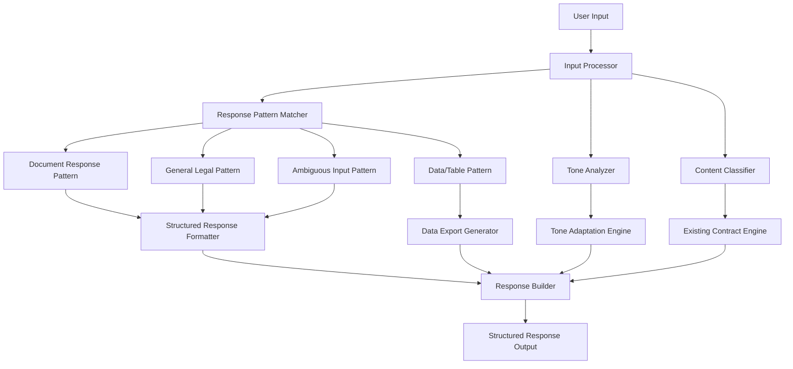

# Design Document

## Overview

The Structured Response Patterns system creates a robust contract analysis assistant that guarantees structured, useful output for any input. The design focuses on pattern-based response formatting, intelligent tone adaptation, automatic data export generation, and comprehensive input interpretation while maintaining the existing contract analysis capabilities.

## Architecture

### High-Level Architecture



### Integration Strategy

The system integrates with existing components by:
- **Wrapping existing contract analysis**: Preserving all current functionality while adding structured formatting
- **Adding response pattern layer**: Applying consistent formatting patterns to all outputs
- **Enhancing with export capabilities**: Automatically generating downloadable content when appropriate
- **Maintaining backward compatibility**: Ensuring existing API contracts remain intact

## Components and Interfaces

### 1. Input Processor

**Purpose**: Analyzes and preprocesses user input to determine response strategy, tone requirements, and content classification.

**Key Features**:
- Input sanitization and normalization
- Multi-part question detection and parsing
- Ambiguity detection and interpretation suggestion
- Context extraction from conversational history

**Interface**:
```python
class InputProcessor:
    def process_input(self, user_input: str, context: ConversationContext) -> ProcessedInput
    def detect_multi_part_questions(self, input_text: str) -> List[QuestionPart]
    def identify_ambiguities(self, input_text: str) -> List[AmbiguityFlag]
    def extract_user_intent_signals(self, input_text: str) -> IntentSignals
    def normalize_input_for_processing(self, input_text: str) -> str
```

### 2. Response Pattern Matcher

**Purpose**: Determines the appropriate response pattern based on question type and content classification.

**Key Features**:
- Pattern selection based on content type (document, general, data, ambiguous)
- Template matching for consistent formatting
- Pattern priority resolution for mixed content types
- Custom pattern support for specialized scenarios

**Interface**:
```python
class ResponsePatternMatcher:
    def match_response_pattern(self, processed_input: ProcessedInput) -> ResponsePattern
    def determine_primary_pattern(self, content_signals: ContentSignals) -> PatternType
    def resolve_pattern_conflicts(self, competing_patterns: List[PatternType]) -> PatternType
    def get_pattern_template(self, pattern_type: PatternType) -> ResponseTemplate
    def customize_pattern_for_context(self, pattern: ResponsePattern, context: dict) -> ResponsePattern
```

### 3. Structured Response Formatter

**Purpose**: Applies consistent formatting patterns to create structured responses with appropriate sections and visual elements.

**Key Features**:
- Document pattern formatting (📋 Evidence, 🔍 Plain English, ⚖️ Implications)
- General legal pattern formatting (ℹ️ Status, 📚 General Rule, 🎯 Application)
- Ambiguous pattern formatting (🤔 My Take, If Option A/B structure)
- Multi-part question formatting with numbered components

**Interface**:
```python
class StructuredResponseFormatter:
    def format_document_response(self, content: str, evidence: List[str], implications: List[str]) -> FormattedResponse
    def format_general_legal_response(self, status: str, general_rule: str, application: str) -> FormattedResponse
    def format_ambiguous_response(self, interpretation: str, options: List[ResponseOption]) -> FormattedResponse
    def format_multi_part_response(self, parts: List[ResponsePart], synthesis: str) -> FormattedResponse
    def apply_visual_formatting(self, content: str, pattern_type: PatternType) -> str
```

### 4. Tone Adaptation Engine

**Purpose**: Analyzes user communication style and adapts response tone while maintaining professional structure and accuracy.

**Key Features**:
- Communication style detection (casual, business, technical, startup)
- Tone matching with professional boundaries
- Complexity level adjustment based on user expertise signals
- Energy level matching while preserving structure

**Interface**:
```python
class ToneAdaptationEngine:
    def analyze_user_tone(self, input_text: str, conversation_history: List[str]) -> ToneProfile
    def determine_response_tone(self, user_tone: ToneProfile, content_type: str) -> ResponseTone
    def adapt_content_complexity(self, content: str, user_expertise: ExpertiseLevel) -> str
    def match_energy_level(self, content: str, user_energy: EnergyLevel) -> str
    def ensure_professional_boundaries(self, adapted_content: str) -> str
```

### 5. Data Export Generator

**Purpose**: Automatically creates downloadable CSV/Excel files when responses contain tabular data or structured information.

**Key Features**:
- Automatic table detection in responses
- CSV and Excel file generation with proper formatting
- Download link creation and management
- Data integrity validation for exports

**Interface**:
```python
class DataExportGenerator:
    def detect_exportable_data(self, response_content: str) -> List[DataTable]
    def generate_csv_export(self, data_table: DataTable) -> ExportFile
    def generate_excel_export(self, data_table: DataTable) -> ExportFile
    def create_download_link(self, export_file: ExportFile) -> str
    def add_export_prompt_to_response(self, response: str, download_links: List[str]) -> str
```

### 6. Content Classifier

**Purpose**: Determines whether questions relate to document content, general legal knowledge, data requests, or require special handling.

**Key Features**:
- Document relevance scoring
- General legal concept detection
- Data/table request identification
- Ambiguity and complexity assessment

**Interface**:
```python
class ContentClassifier:
    def classify_content_type(self, processed_input: ProcessedInput, document: Document) -> ContentClassification
    def assess_document_relevance(self, question: str, document_content: str) -> float
    def detect_general_legal_concepts(self, question: str) -> List[LegalConcept]
    def identify_data_requests(self, question: str) -> DataRequestType
    def measure_question_complexity(self, question: str) -> ComplexityLevel
```

## Data Models

### Core Response Models

```python
@dataclass
class ProcessedInput:
    original_text: str
    normalized_text: str
    question_parts: List[QuestionPart]
    ambiguities: List[AmbiguityFlag]
    intent_signals: IntentSignals
    tone_profile: ToneProfile
    complexity_level: ComplexityLevel

@dataclass
class ResponsePattern:
    pattern_type: PatternType  # document, general_legal, data_table, ambiguous
    template: ResponseTemplate
    required_sections: List[str]
    optional_sections: List[str]
    formatting_rules: Dict[str, str]
    export_requirements: Optional[ExportRequirements]

@dataclass
class FormattedResponse:
    content: str
    pattern_used: PatternType
    sections: Dict[str, str]  # section_name -> content
    export_files: List[ExportFile]
    download_links: List[str]
    tone_adaptations: List[str]
    confidence_indicators: Dict[str, float]
```

### Pattern-Specific Models

```python
@dataclass
class DocumentResponseContent:
    evidence_section: str  # 📋 Evidence with quotes/references
    plain_english_section: str  # 🔍 Plain English explanation
    implications_section: str  # ⚖️ Implications with risks/actions
    source_references: List[str]
    confidence_level: float

@dataclass
class GeneralLegalResponseContent:
    status_section: str  # ℹ️ Status: document coverage info
    general_rule_section: str  # 📚 General Rule: standard practices
    application_section: str  # 🎯 Application: practical guidance
    transparency_indicators: List[str]
    confidence_qualifiers: List[str]

@dataclass
class AmbiguousResponseContent:
    interpretation_statement: str  # 🤔 My Take: primary interpretation
    option_analyses: List[ResponseOption]  # If Option A/B alternatives
    synthesis_section: Optional[str]  # How options connect
    clarification_questions: List[str]
    recommended_approach: str
```

### Tone and Adaptation Models

```python
@dataclass
class ToneProfile:
    formality_level: str  # casual, business, formal, academic
    energy_level: str  # low, moderate, high, enthusiastic
    technical_level: str  # basic, intermediate, advanced, expert
    communication_style: str  # direct, conversational, analytical, creative
    domain_familiarity: str  # beginner, familiar, expert

@dataclass
class ResponseTone:
    target_formality: str
    complexity_adjustment: str
    energy_matching: str
    terminology_level: str
    explanation_depth: str
    professional_boundaries: List[str]
```

### Export and Data Models

```python
@dataclass
class DataTable:
    headers: List[str]
    rows: List[List[str]]
    table_type: str  # summary, detailed, comparison, timeline
    export_formats: List[str]  # csv, excel, json
    metadata: Dict[str, str]

@dataclass
class ExportFile:
    file_path: str
    filename: str
    format_type: str  # csv, xlsx, json
    download_url: str
    creation_timestamp: datetime
    expiration_time: Optional[datetime]
    file_size: int
```

## Response Pattern Implementation

### 1. Document Response Pattern

**Template Structure**:
```
### 📋 Evidence
[Direct quotes or specific references from document]

### 🔍 Plain English
[Simplified explanation of complex terms or concepts]

### ⚖️ Implications
[Practical consequences, risks, and actionable insights]
```

**Implementation Logic**:
1. Extract relevant document sections and quotes
2. Identify complex legal terms requiring explanation
3. Analyze practical implications and risks
4. Format with consistent visual elements
5. Add source references and confidence indicators

### 2. General Legal Response Pattern

**Template Structure**:
```
### ℹ️ Status
Document doesn't cover this, but typically...

### 📚 General Rule
[Standard legal practices or principles]

### 🎯 Application
[How it works in practice]
```

**Implementation Logic**:
1. Clearly indicate document coverage status
2. Provide relevant general legal knowledge
3. Explain practical application
4. Include confidence qualifiers and professional consultation recommendations

### 3. Data/Table Response Pattern

**Template Structure**:
```
[Structured table with clear headers]

📥 **Export:** CSV/Excel available here: [download links]
```

**Implementation Logic**:
1. Detect requests for tabular data
2. Structure information in clear table format
3. Generate CSV and Excel exports automatically
4. Provide immediate download links
5. Ensure data integrity and proper formatting

### 4. Ambiguous Input Response Pattern

**Template Structure**:
```
🤔 **My Take:** I'm reading this as [primary interpretation]

**If Option A:** [Analysis for first interpretation]
**If Option B:** [Analysis for second interpretation]

**Synthesis:** [How interpretations connect or differ]
```

**Implementation Logic**:
1. Identify multiple possible interpretations
2. Provide analysis for each viable option
3. Explain connections or conflicts between interpretations
4. Recommend most practical approach
5. Offer clarification questions when helpful

## Error Handling and Fallbacks

### Input Processing Errors
- **Malformed Input**: Clean and normalize while preserving intent
- **Ambiguity Detection Failure**: Default to primary interpretation with acknowledgment
- **Context Extraction Issues**: Continue with available information

### Pattern Matching Errors
- **No Clear Pattern Match**: Default to document pattern with general formatting
- **Multiple Pattern Conflicts**: Use priority system (document > general > data > ambiguous)
- **Template Loading Failure**: Use basic structured format as fallback

### Formatting and Export Errors
- **Formatting Failure**: Return content with basic structure
- **Export Generation Failure**: Provide response without download links, log for improvement
- **Download Link Creation Issues**: Include export data inline as fallback

### Tone Adaptation Errors
- **Tone Detection Failure**: Use neutral professional tone
- **Adaptation Conflicts**: Prioritize accuracy over tone matching
- **Complexity Adjustment Issues**: Default to intermediate complexity level

## Testing Strategy

### Pattern Recognition Testing
- **Document Pattern**: Test with various contract questions and document types
- **General Legal Pattern**: Test with legal concepts not in documents
- **Data Pattern**: Test with requests for tables, lists, and structured data
- **Ambiguous Pattern**: Test with unclear, multi-interpretation questions

### Tone Adaptation Testing
- **Style Matching**: Test with casual, business, technical, and creative inputs
- **Energy Matching**: Test with various enthusiasm and formality levels
- **Complexity Adjustment**: Test with different expertise level indicators
- **Professional Boundary**: Test that accuracy is never compromised for tone

### Export Functionality Testing
- **Automatic Detection**: Test recognition of exportable data in responses
- **File Generation**: Test CSV and Excel creation with various data types
- **Download Links**: Test link creation, expiration, and accessibility
- **Data Integrity**: Test that exported data matches response content

### Integration Testing
- **Existing Engine Compatibility**: Ensure all current functionality remains intact
- **Response Quality**: Test that structured patterns improve rather than degrade responses
- **Performance Impact**: Measure latency introduced by pattern processing
- **Error Handling**: Test graceful degradation when components fail

## Performance Considerations

### Response Time Optimization
- **Pattern Caching**: Cache common response templates and patterns
- **Parallel Processing**: Process tone analysis and content classification simultaneously
- **Template Pre-loading**: Load frequently used templates at startup
- **Export Generation**: Generate exports asynchronously when possible

### Memory Management
- **Template Storage**: Efficient storage and retrieval of response templates
- **Export File Management**: Automatic cleanup of temporary export files
- **Context Caching**: Limit conversation context size with intelligent pruning
- **Pattern Matching**: Optimize pattern recognition algorithms for speed

### Scalability Considerations
- **Concurrent Processing**: Handle multiple simultaneous requests efficiently
- **Export File Storage**: Scalable storage solution for generated files
- **Template Customization**: Support for user-specific or domain-specific patterns
- **Performance Monitoring**: Track response times and resource usage

## Security and Privacy

### Input Validation
- **Sanitization**: Clean user inputs while preserving meaning
- **Injection Prevention**: Prevent template injection or manipulation
- **Content Filtering**: Ensure appropriate content in all response patterns
- **Size Limits**: Prevent resource exhaustion from oversized inputs

### Export Security
- **File Access Control**: Secure download links with expiration
- **Data Privacy**: Ensure no sensitive information in export files
- **Storage Security**: Secure temporary file storage and cleanup
- **Download Tracking**: Log export access for security monitoring

### Response Content Security
- **Information Disclosure**: Prevent leakage of sensitive document content
- **Pattern Manipulation**: Prevent users from manipulating response patterns
- **Template Security**: Secure template storage and modification
- **Content Validation**: Validate all generated content for appropriateness

## Deployment Strategy

### Gradual Implementation
1. **Phase 1**: Deploy pattern recognition and basic formatting
2. **Phase 2**: Add tone adaptation and complexity adjustment
3. **Phase 3**: Implement export functionality and download links
4. **Phase 4**: Full deployment with monitoring and optimization

### Configuration Management
- **Pattern Templates**: Configurable response templates and formatting rules
- **Tone Settings**: Adjustable tone adaptation parameters
- **Export Options**: Configurable export formats and retention policies
- **Performance Tuning**: Adjustable caching and processing parameters

### Monitoring and Analytics
- **Pattern Usage**: Track which response patterns are most effective
- **User Satisfaction**: Monitor user engagement with structured responses
- **Export Analytics**: Track download rates and export format preferences
- **Performance Metrics**: Monitor response times and resource usage
- **Error Tracking**: Log and analyze pattern matching and formatting errors